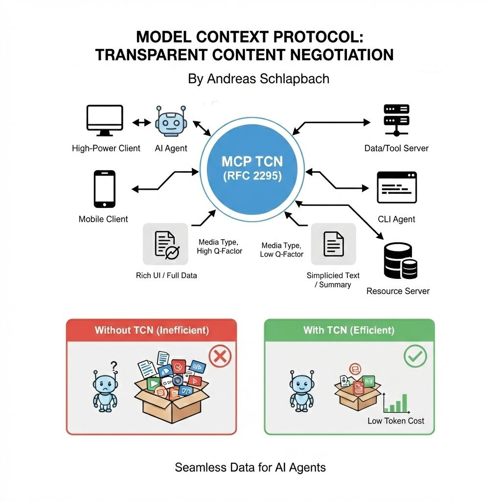

[](#status)
[](https://github.com/schlpbch/agentic-content-negotiation/releases)
[](#status)
[](#about-this-extension)

# Content Negotiation Extension for MCP

> **📦 Official MCP Extension Proposal**
>
> This is a proposed official MCP extension following
> [SEP-2133: Extensions](https://modelcontextprotocol.io/community/seps/2133-extensions).
> It introduces transparent content negotiation to allow servers to adapt
> response formats based on client capabilities.

A formal proposal for a **Content Negotiation Extension** to the Model Context
Protocol (MCP), enabling clients to declare preferences and servers to adapt
content format accordingly. Inspired by
[RFC 2295](https://www.rfc-editor.org/rfc/rfc2295.html) (Transparent Content
Negotiation for HTTP), adapted for MCP's session-scoped architecture.

## Overview

This project proposes a **content negotiation mechanism** that allows MCP
servers to adapt response formats based on client-declared capabilities. Instead
of serving one-size-fits-all responses, servers can:

- Return **JSON for AI agents** that need structured data
- Return **markdown for humans** who need narrative explanations
- Return **reasoning hints for agents with sampling** vs simple results for
  agents without
- Gate **interactive dialogs** based on client's elicitation capability



Diagram illustrating the process of content negotiation between a client and a
server in the Model Context Protocol. The client sends an initialization request
specifying capabilities and preferred content formats such as JSON or markdown.
The server evaluates these preferences and responds with content tailored to the
client's needs, for example structured JSON for agents or markdown for humans.
Arrows indicate the flow of requests and responses. The environment is a
technical workflow with labeled steps and callouts. Text in the image includes
labels like Client, Server, Initialize with capabilities, and Response with
negotiated content. The tone is neutral and informative, focusing on technical
clarity.

## Problem Statement

MCP servers currently cannot distinguish between:

- AI agents that need structured data for processing
- Humans that need narrative explanations
- Agents with different protocol capabilities (sampling, elicitation, roots,
  tasks)

This leads to either:

1. **Duplicate tools** (weather_json + weather_prose)
2. **Unreliable heuristics** (guessing based on clientInfo.name)
3. **Bloated responses** (supporting all formats simultaneously)

## Solution: Transparent Content Negotiation (Extension)

Clients declare the extension and their capabilities during `initialize`:

```json
{
  "capabilities": {
    "extensions": {
      "io.modelcontextprotocol/content-negotiation": {
        "version": "1.0",
        "features": ["agent", "sampling", "format=json", "verbosity=compact"]
      }
    }
  }
}
```

Servers advertise support and respond with content optimized for those
capabilities:

```json
{
  "capabilities": {
    "extensions": {
      "io.modelcontextprotocol/content-negotiation": {}
    }
  }
}
```

Tool response (JSON-formatted for agents):

```json
{
  "structuredContent": {
    "type": "object",
    "properties": {
      "temperature_c": 8,
      "humidity_percent": 72
    }
  }
}
```

## Key Features

- [x] **[RFC 2295](https://www.rfc-editor.org/rfc/rfc2295.html)-Inspired**:
      Borrows concepts from HTTP transparent content negotiation, adapted to MCP
- [x] **Session-Scoped**: Negotiation happens once at initialization, not
      per-request
- [x] **Capability-Driven**: Feature tags mirror client's actual MCP
      capabilities
- [x] **Flexible Predicates**: Supports presence, negation, and equality syntax
- [x] **Fully Backward Compatible**: Zero breaking changes, optional feature
- [x] **Secure**: Feature tags are for content shape only, never for auth/access
      control

## Real-World Use Cases

### 1. Journey Service

- **Problem**: Agent needs structured connection data; human needs readable
  itinerary
- **Solution**: One tool, negotiated format (JSON for agent, markdown for human)

### 2. Geospatial/Mapping Service

- **Problem**: Geographic data comes as rich descriptions; agents need
  coordinates/boundaries
- **Solution**: Server returns `application/json` (GeoJSON) for agents,
  `text/markdown` for humans

### 3. Multi-Agent Orchestration

- **Problem**: Different specialist agents have different capabilities
- **Solution**: Orchestrator reads each agent's capabilities at init, server
  adapts responses

### 4. Weather/Environment Services

- **Problem**: Same data used by agents (need JSON) and humans (need prose)
- **Solution**: Negotiated format eliminates duplication

## Document Structure

### Main Document: `SEP-DRAFT-agent-content-negotiation.md`

**1,210 lines** covering:

- **Abstract** - Problem and solution overview
- **Motivation** - 6 real-world use cases + 4 workaround analyses
- **Specification** - New capabilities, feature tags, examples
- **Rationale** - Design decisions, RFC 2295 mapping, alternatives considered
- **Backward Compatibility** - No breaking changes, migration path
- **Security Implications** - 5 risks analyzed with mitigations
- **Reference Implementation** - TypeScript schemas, helper functions, examples
- **Additional Sections** - Performance, testing, open questions

## Feature Tags (v1.0 Registry)

| Tag                                            | Meaning                   | Server Impact                           |
| ---------------------------------------------- | ------------------------- | --------------------------------------- |
| `agent` / `human`                              | Client type               | Content format preference               |
| `mcp-capable`                                  | Understands MCP protocols | Can reference tool/resource names       |
| `interactive` / `!interactive`                 | Can present UI            | Gate elicitation-style prompts          |
| `sampling` / `elicitation` / `roots` / `tasks` | Declared MCP capabilities | Include reasoning hints, allow requests |
| `verbosity=compact\|standard\|verbose`         | Response length           | Omit/expand explanations                |
| `format=json\|text\|markdown`                  | Output format             | Use structuredContent vs prose          |
| `x-*`                                          | Vendor-specific           | Custom implementations                  |

## How to Review

### For MCP Maintainers & Contributors

1. **Read the Abstract** (2 min) - Understand the problem and solution
2. **Review Motivation** (10 min) - Validate the real-world use cases
3. **Examine Specification** (15 min) - Ensure implementability
4. **Check Rationale** (5 min) - Verify design decisions
5. **Assess Security** (5 min) - Confirm risks are mitigated
6. **Review Reference Implementation** (10 min) - Validate feasibility

### Key Questions to Answer

- ✓ Does this solve real problems?
- ✓ Is the specification clear and implementable?
- ✓ Are security implications properly addressed?
- ✓ Is backward compatibility truly maintained?
- ✓ Are there better alternatives?

### Expected Timeline

- **Draft Phase**: Community feedback and refinement (this stage)
- **In-Review Phase**: Core Maintainer review + reference implementation
- **Final Phase**: Approval and integration into MCP spec

## Quick Start for Implementation

### Server Side

```typescript
// Parse client features at initialization (from extension settings)
const extensionSettings = client.capabilities.extensions?.["io.modelcontextprotocol/content-negotiation"];
const features = extensionSettings?.features || [];

// Check client type
const isAgent = features.includes("agent");
const wantsJson = features.includes("format=json");

// Vary tool responses
if (isAgent && wantsJson) {
  return { structuredContent: {...} };  // JSON
} else {
  return { content: [{type: "text", text: "..."}] };  // Markdown
}

// Advertise extension support
const serverCapabilities = {
  extensions: {
    "io.modelcontextprotocol/content-negotiation": {}  // Empty object = support
  }
};
```

### Client Side

```typescript
// Declare extension support at initialization
const capabilities = {
  sampling: {},
  extensions: {
    'io.modelcontextprotocol/content-negotiation': {
      version: '1.0',
      features: [
        'agent',
        'sampling',
        'mcp-capable',
        'format=json',
        'verbosity=compact',
      ],
    },
  },
};
```

## Security & Privacy

### What Features Are NOT Used For

- ❌ Authentication (use credentials instead)
- ❌ Authorization (use access control lists)
- ❌ Trust decisions (use signatures/verification)
- ❌ Rate limiting (use auth tokens)

### What Features ARE Used For

- ✅ Content format selection (JSON vs markdown)
- ✅ Response length (verbosity)
- ✅ Response hints (reasoning steps)

**Principle**: Feature tags optimize _what the server sends_, not _whether the
server should send it_.

## Examples Included

### Tool Response Variants

- Agent requesting JSON → `{ structuredContent: {...} }`
- Agent with sampling → `{ structuredContent: { hints: [...] } }`
- Agent without interactive → `{ structuredContent: {...} }` (no dialogs)
- Human requesting markdown → `{ content: [{type: "text", text: "..."}] }`

### Initialize Scenarios

- **Scenario 1**: AI agent with full capabilities
- **Scenario 2**: Human user in chat interface
- **Scenario 3**: Legacy client (no negotiation)

### RFC 2295 Mapping

13-row table showing:

- What concepts were **adopted** from RFC 2295
- What were **adapted** for MCP
- What were **rejected** as unnecessary
- What was **deferred** to v1.1+

## Contributing

We welcome community feedback on this extension proposal:

1. **Review** the specification in `SEP-DRAFT-agent-content-negotiation.md`
2. **Provide feedback** via:
   - This repository's
     [Issues](https://github.com/schlpbch/agentic-content-negotiation/issues)
   - [MCP Community Discussions](https://github.com/modelcontextprotocol/modelcontextprotocol/discussions)
   - Working groups (if established)
3. **Test** reference implementations with your server/client code
4. **Suggest** improvements or refinements to feature tags, semantics, or design

### Next Steps for Contributors

- **Read and review** `SEP-DRAFT-agent-content-negotiation.md`
- **Implement** reference support in your SDK or server
- **Report issues** and learnings back to this repository
- **Advocate** for the extension if you find it valuable for your use cases

Community input will shape the final design and determine whether this extension
graduates to official MCP status.

## Links

### MCP Resources

- **MCP Specification**: https://modelcontextprotocol.io/specification
- **SEP-2133: Extensions Framework**:
  https://modelcontextprotocol.io/community/seps/2133-extensions
- **SEP Process**: https://modelcontextprotocol.io/community/sep-guidelines
- **MCP Community**:
  https://github.com/modelcontextprotocol/modelcontextprotocol

### Technical References

- **RFC 2295**: https://www.rfc-editor.org/rfc/rfc2295.html (Transparent Content
  Negotiation for HTTP)
- **This Repository**: https://github.com/schlpbch/agentic-content-negotiation
- **Extension Specification**: `SEP-DRAFT-agent-content-negotiation.md` (this
  repository)

## About This Extension

- **Extension ID**: `io.modelcontextprotocol/content-negotiation`
- **Framework**: Proposed under
  [SEP-2133: Extensions](https://modelcontextprotocol.io/community/seps/2133-extensions)
- **Target Repository**:
  `https://github.com/modelcontextprotocol/ext-content-negotiation` (upon
  approval)

## Status

- **Status**: Draft
- **Type**: Extensions Track
- **Created**: February 22, 2026
- **Current Phase**: Community feedback and design refinement

---

## Related Analysis Documents

This project includes supporting analysis:

- **RFC2295_ANALYSIS.md** - Deep dive into RFC 2295 concepts
- **MCP_ANALYSIS.md** - Current MCP architecture and capability model
- **MCP_PROPOSAL_GUIDE.md** - MCP SEP process and requirements

## License

This proposal is part of the MCP community process and follows MCP's licensing
model.

---

**For questions or feedback**: Open an issue or discussion in this repository.

**To sponsor this SEP**: Contact the MCP maintainers.
